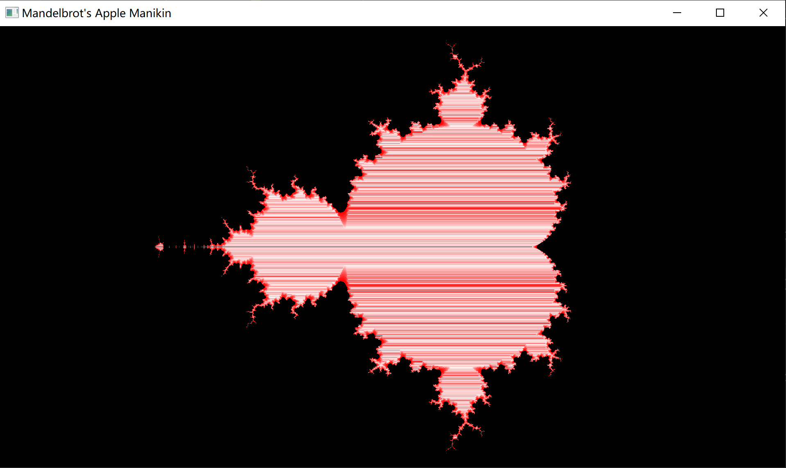

### 在windows上MSYS2/ucrt64/gcc环境中使用CMake和SDL2

和GLFW相比，SDL2除了具备GLFW的基本功能外，还拥有基本的绘制功能。下面尝试设置SDL2的开发环境，并用cpp代码绘制mandlebrot分形图形。

### MSYS2的安装和设置

在windows上可以用MSYS2安装非VC的CPP编译环境，非常轻量且绿色环保。MSYS2像cygwin一样集成了不少Linux（posix）工具程序，使用起来比较简洁。

MSYS2上安装开发工具链的命令（以ucrt64环境为例）：

```
pacman -S mingw-w64-ucrt-x86_64-toolchain
```


### VSCode配置CMake
首先添加ucrt64/gcc路径到环境变量中。在开始菜单输入environment，点击"编辑系统环境变量"，在用户环境path中录入ucrt64/bin目录。
打开vscode，使用快捷键ctrl+shift+p,输入cmake::scan for kit。CMake会扫面到gcc工具链并加入到配置中。下面是cmake工具扫描新增加的gcc工具链的日志，日志中显示了新的工具链配置被写入到`C:\Users\xxx\AppData\Local\CMakeTools\cmake-tools-kits.json`文件中。

```verilog
[proc] Executing command: "C:\Program Files\CMake\bin\cmake.EXE" --version
[proc] Executing command: "C:\Program Files\CMake\bin\cmake.EXE" -E capabilities
[kit] Successfully loaded 4 kits from C:\Users\xxx\AppData\Local\CMakeTools\cmake-tools-kits.json
[variant] Loaded new set of variants
[proc] Executing command: chcp
[proc] Executing command: C:\msys2_64\ucrt64\bin\gcc.exe -v
[proc] Executing command: C:\msys2_64\ucrt64\bin\x86_64-w64-mingw32-gcc-14.2.0.exe -v
[proc] Executing command: C:\msys2_64\ucrt64\bin\x86_64-w64-mingw32-gcc.exe -v
[proc] Executing command: C:\msys2_64\ucrt64\bin\mingw32-make.exe -v
[proc] Executing command: C:\msys2_64\ucrt64\bin\x86_64-w64-mingw32-gcc.exe -v
[proc] Executing command: C:\msys2_64\ucrt64\bin\mingw32-make.exe -v
[proc] Executing command: C:\msys2_64\ucrt64\bin\mingw32-make.exe -v
[kit] Found Kit (trusted): GCC 14.2.0 x86_64-w64-mingw32 (ucrt64)
[kit] Found Kit (trusted): GCC 14.2.0 x86_64-w64-mingw32 (ucrt64)
[kit] Found Kit (trusted): GCC 14.2.0 x86_64-w64-mingw32 (ucrt64)
[kit] Found Kit (trusted): Visual Studio Community 2022 Release - x86
[kit] Found Kit (trusted): Visual Studio Community 2022 Release - x86_amd64
[kit] Found Kit (trusted): Visual Studio Community 2022 Release - amd64_x86
[kit] Found Kit (trusted): Visual Studio Community 2022 Release - amd64
[kit] Found Kit (trusted): Visual Studio Community 2019 Release - x86
[kit] Found Kit (trusted): Visual Studio Community 2019 Release - x86_amd64
[kit] Found Kit (trusted): Visual Studio Community 2019 Release - amd64_x86
[kit] Found Kit (trusted): Visual Studio Community 2019 Release - amd64
[kit] Successfully loaded 9 kits from C:\Users\xxx\AppData\Local\CMakeTools\cmake-tools-kits.json

```


### SDL2库的安装
ucrt64环境对应的SDL2库的包名为mingw-w64-ucrt-x86_64-SDL2。使用下面的命令进行安装。vscode和cmake tool在工具链扫描成功时已经记录相关的编译器和库的安装路径，sdl2安装后可以在vscode中直接使用，否则可能需要添加编译器的path到环境变量中。
```
pacman -S mingw-w64-ucrt-x86_64-SDL2
```

### Mandlebrot绘制代码
基于SDL2编写mandlebrot绘制代码，本例修改自DMC2中的例子。

```cpp
#include <cstdlib>
#include <cstdint>
#include <cassert>
#include <complex>
#include<iostream>

#include <SDL2/SDL.h>


using namespace std;

bool init();
void kill();
bool loop();

// Pointers to our window and renderer
SDL_Window* window;
SDL_Renderer* renderer;


struct sdl_error {};
inline void sdl_check(bool allclear) { if (!allclear) throw sdl_error(); }

inline void put_pixel(SDL_Renderer* renderer, int x, int y, uint32_t pixel)
{
    // assert(screen->format->BytesPerPixel == 4);
    // auto pixel_address= reinterpret_cast<uint32_t*>(screen->pixels) + y * screen->w + x;
    // *pixel_address= pixel;
    SDL_RenderDrawPoint(renderer,x,y);
}

class mandel_pixel
{
  public:
    mandel_pixel(SDL_Renderer* renderer, int x, int y, int xdim, int ydim, int max_iter)
      : renderer(renderer), max_iter(max_iter), iter(0), c(x, y)
    {
	// scale y to [-1.2,1.2] and shift -0.5+0i to the center
	c*= 2.4f / static_cast<float>(ydim);  
	c-= complex<float>(1.2 * xdim / ydim + 0.5, 1.2); 
	iterate();
    }

    int iterations() const { return iter; }
    uint32_t color() const 
    {
	if (iter == max_iter) return 0;
	const int ci= 512 * iter / max_iter; // incremental value for color
	// return SDL_MapRGB(screen->format, 40*iter & 255, 66*iter & 255, 100*iter & 255);
	// return iter < max_iter/2 ? SDL_MapRGB(screen->format, ci, 0, 0)
	//                          : SDL_MapRGB(screen->format, 255, ci-255, ci-255);
    return iter < max_iter/2 ? SDL_SetRenderDrawColor( renderer, 0, 0, 0, 255 )
                                : SDL_SetRenderDrawColor( renderer, 255, ci-255, ci-255,255);
    }

  private:
    void iterate()
    {
	complex<float> z= c;
	for (; iter < max_iter && norm(z) <= 4.0f; iter++)
	    z= z * z + c;
    };

    SDL_Renderer* renderer;
    const int max_iter;
    int iter;
    complex<float> c;
};


int main(int argc, char** args) {

	if ( !init() ) return 1;

	while ( loop() ) {
		// wait before processing the next frame
		SDL_Delay(10); 
	}

	kill();
	return 0;
}

bool loop() {

	static const unsigned char* keys = SDL_GetKeyboardState( NULL );

	SDL_Event e;
	SDL_Rect r;
	// For mouse rectangle (static to presist between function calls)
	static int mx0 = -1, my0 = -1, mx1 = -1, my1 = -1;

	// Clear the window to white
	SDL_SetRenderDrawColor( renderer, 255, 255, 255, 255 );
	SDL_RenderClear( renderer );

	// Event loop
	while ( SDL_PollEvent( &e ) != 0 ) {
		switch ( e.type ) {
			case SDL_QUIT:
				return false;
			case SDL_MOUSEBUTTONDOWN:
				mx0 = e.button.x;
				my0 = e.button.y;
				break;
			case SDL_MOUSEMOTION:
				mx1 = e.button.x;
				my1 = e.button.y;
				break;
			case SDL_MOUSEBUTTONUP:
				mx0 = my0 = mx1 = my1 = -1;
				break;
		}
	}

	// Set drawing color to black
	SDL_SetRenderDrawColor( renderer, 0, 0, 0, 255 );

	// Test key states - this could also be done with events
	if ( keys[SDL_SCANCODE_1] ) {
		SDL_RenderDrawPoint( renderer, 10, 10 );
	}
	if ( keys[SDL_SCANCODE_2] ) {
		SDL_RenderDrawLine( renderer, 10, 20, 10, 100 );
	}
	if ( keys[SDL_SCANCODE_3] ) {
		r.x = 20;
		r.y = 20;
		r.w = 100;
		r.h = 100;
		SDL_RenderFillRect( renderer, &r );
	}

	// Render mouse rectangle
	if ( mx0 != -1 ) {
		r.x = mx0;
		r.y = my0;
		r.w = mx1 - mx0;
		r.h = my1 - my0;
		SDL_RenderDrawRect( renderer, &r );
	}

    const int max_iter= 30;
    int xdim= 1920, ydim= 1080;
    // if (argc >= 3)
	// xdim= atoi(argv[1]), ydim= atoi(argv[2]);
    
    for (int y= 0; y < ydim; y++)
	for (int x= 0; x < xdim; x++) {
	    mandel_pixel m(renderer, x, y, xdim, ydim, max_iter);
	    put_pixel(renderer, x, y, m.color());
	}

	// Update window
	SDL_RenderPresent( renderer );

	return true;
}

bool init() {
	// See last example for comments
	if ( SDL_Init( SDL_INIT_EVERYTHING ) < 0 ) {
		cout << "Error initializing SDL: " << SDL_GetError() << endl;
		system("pause");
		return false;
	} 

	window = SDL_CreateWindow("Mandelbrot's Apple Manikin",
                          SDL_WINDOWPOS_UNDEFINED,
                          SDL_WINDOWPOS_UNDEFINED,
                          1920, 1080,
                          SDL_WINDOW_SHOWN | SDL_WINDOW_RESIZABLE | SDL_WINDOW_OPENGL);
    if ( !window ) {
		cout << "Error creating window: " << SDL_GetError()  << endl;
		system("pause");
		return false;
	}

	renderer = SDL_CreateRenderer( window, -1, SDL_RENDERER_ACCELERATED );
	if ( !renderer ) {
		cout << "Error creating renderer: " << SDL_GetError() << endl;
		return false;
	}

	SDL_SetRenderDrawColor( renderer, 255, 255, 255, 255 );
	SDL_RenderClear( renderer );
	return true;
}

void kill() {
	// Quit
	SDL_DestroyRenderer( renderer );
	SDL_DestroyWindow( window );
	SDL_Quit();
}
```


### CMake脚本中如何链接SDL2库文件

主要关注msys2环境和sdl2相关链接库的名称。

```cmake
add_executable (${madlebrotApp} "madlebrot.cc")
target_link_libraries(${madlebrotApp} mingw32)
target_link_libraries(${madlebrotApp} SDL2main)
target_link_libraries(${madlebrotApp} SDL2)
```

如果不使用CMake，上面的cpp代码可以自己使用如下的gcc命令编译：
```
#g++ mandelbrot.cpp -LC:/msys64/ucrt64/lib  -lmingw32 -lSDL2main -lSDL2 -mwindows
#g++ mandelbrot.cpp -lmingw32 -lSDL2main -lSDL2 -mwindows
```

程序运行效果：




> 参考文章：
>
> 1. https://wiki.libsdl.org/SDL2/README/cmake
>
> 2. https://www.cnblogs.com/renhui/p/10460512.html
>
> 3. https://stackoverflow.com/questions/28597351/how-do-i-add-a-library-path-in-cmake
>
> 4. https://stackoverflow.com/questions/28395833/using-sdl2-with-cmake
>
> 5. https://lazy-phosphorus.com/post/msys2-cmake-guide/
>
> 6. https://www.cnblogs.com/tangwc/p/17316750.html 
>
> 7. https://www.wikieee.com/blog/leiad/pc_sw/%E5%9F%BA%E4%BA%8Emsys2%E7%9A%84mingw64%20gcc%E5%92%8Ccmake%E5%9C%A8win%E4%B8%8Bvscode%E9%87%8C%E6%90%AD%E5%BB%BAsdl2%E5%BC%80%E5%8F%91%E7%8E%AF%E5%A2%83/we
>
>    